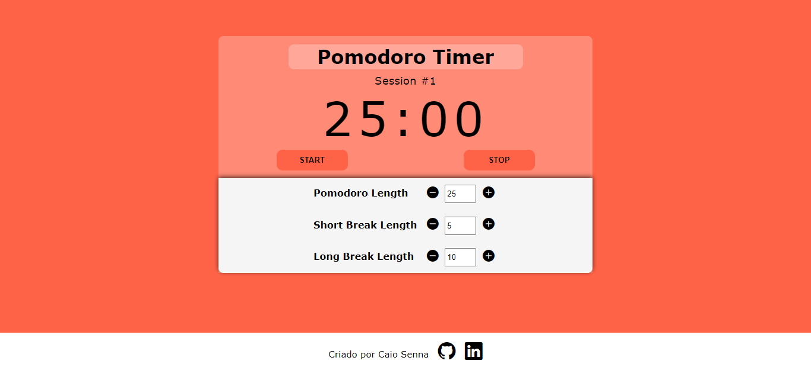
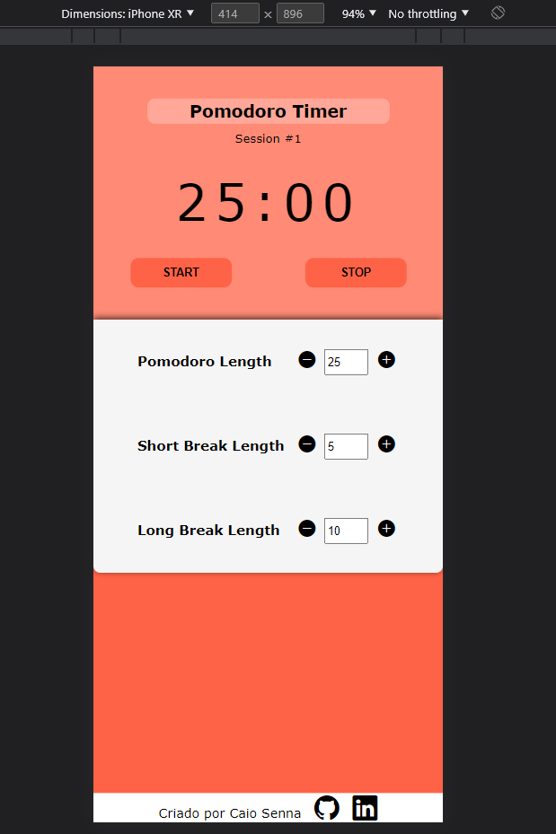

# Relógio Pomodoro

A técnica Pomodoro é um método de administração do tempo desenvolvido por Francesco Cirillo no fim dos anos 1980. A técnica utiliza um timer para dividir a tarefas em intervalos, que são tradicionalmente de 25 minutos e são separados por pardas curtas de 5 minutos.

## Acessando a página
A página está hospedada no Github Pages e pode ser acessada através do link https://cclsenna.github.io/pomodoro-timer/


## Executando localmente
Para executar a página localmente,basta realizar o clone do repositório

```
Via HTTPS
$ git clone https://github.com/cclsenna/pomodoro-timer.git

Via SSH
$ git clone git@github.com:cclsenna/pomodoro-timer.git
```

Em seguida basta abrir o arquivo **index.html** no navegador de sua escolha.

## Funcionalidades

- O relógio irá emitir um alarme toda vez que uma contagem de tempo terminar.

- Após cada sessão de  trabalho "Pomodoro", o relógio irá automaticamente reiniciar para  o tempo de parada predefinido (Short/Long Break) 

- O usuário pode personalizar o tempo desejado para cada um dos três intervalos utilzando os botões na parte de baixo do timer(Sessão comum,Short Break e Long Break)

### Versão Desktop




### Versão Mobile




